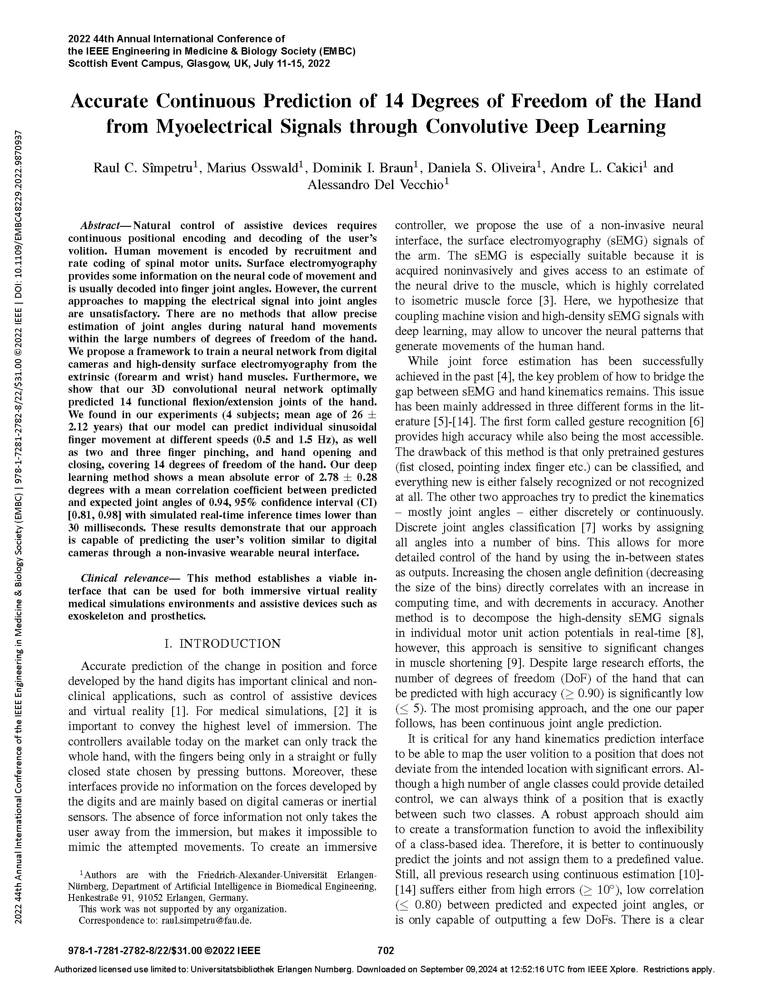

# DocOctopy

## What is this?
DocOctopy , the **research** library for kinematics, kinetics, and everything else you can think of that has to do with EMG and AIs.
> **Important**  
> Be aware that this project is used for **research**. Do not expect the same stability as from numpy for example.

## What papers use this package?

  
  &nbsp;&nbsp;&nbsp;&nbsp;&nbsp;
  
  &nbsp;&nbsp;&nbsp;&nbsp;&nbsp;
  

  &nbsp;&nbsp;&nbsp;&nbsp;&nbsp;
  
  &nbsp;&nbsp;&nbsp;&nbsp;&nbsp;
  

## How to install?
> **WARNING**   
> Order matters!
- clone
- install [poetry](https://python-poetry.org/docs/#installation)
- based on your hardware:
  - GPU (NVIDIA): `poetry install -E gpu --with pytorch_gpu`
  - CPU: `poetry install -E cpu`
- for building the documentation add `docs` to the *with* flag: `poetry install --with docs`

## What is what?
This projects uses the following structure:
- doc_octopy: This is the main package. It contains:
  - datasets: Contains data loaders and creators as well as a lot of filters to preprocess the data.
  - models: Contains all models and their components.
  - utils: Various utilities from training loggers to constants.
- docs: Contains the documentation.
- examples: Contains examples on how to use the package.
- tests: Contains tests for the package.