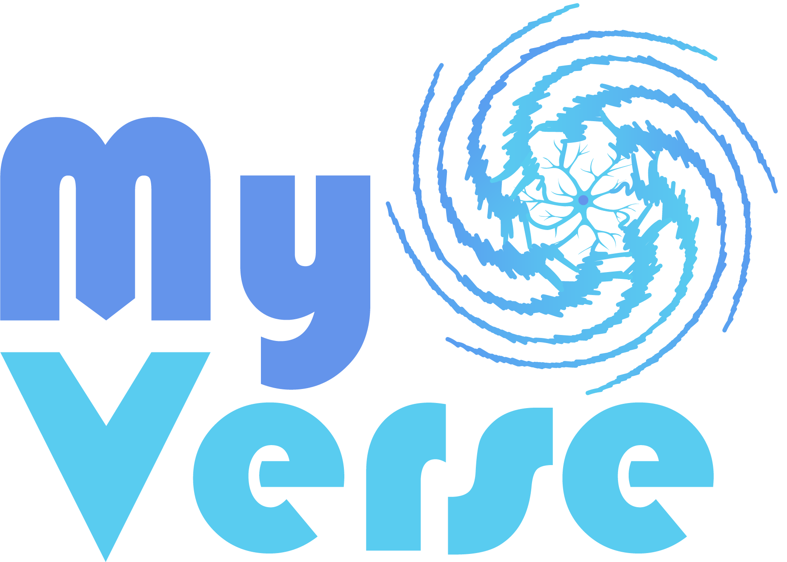

Welcome to |logo|
===========================

**The AI toolkit for myocontrol research**

MyoVerse is your cutting-edge **research** companion for unlocking the secrets hidden within biomechanical data! It's specifically designed for exploring the complex interplay between **electromyography (EMG)** signals, **kinematics** (movement), and **kinetics** (forces).

Leveraging the power of **PyTorch** and **PyTorch Lightning**, MyoVerse provides a comprehensive suite of tools for researchers and developers working with myoelectric signal analysis and AI-driven biomechanical applications.

.. raw:: html

    

        <form class="bd-search align-items-center" action="search.html" method="get">
          <input type="search" class="form-control search-front-page" name="q" id="search-input" placeholder="&#128269; Search the docs ..." aria-label="Search the docs ..." autocomplete="off">
        </form>
    

Key Features
-----------

* **Data loaders** and **preprocessing filters** tailored for biomechanical signals
* Peer-reviewed **AI models** and components for analysis and prediction tasks
* Comprehensive visualization tools
* Essential **utilities** to streamline the research workflow

.. important::
   MyoVerse is built for **research**. While powerful, it's evolving and may not have the same level of stability as foundational libraries like NumPy.

Package Structure
----------------

* **myoverse**: Main package containing:
   * **datasets**: Data loaders, dataset creators, and preprocessing filters
   * **models**: AI models and components for training and evaluation
   * **utils**: Support for data handling, model training, and analysis
* **examples**: Practical examples including tutorials and use cases

Research
----------------------

MyoVerse has been used in several publications:

* IEEE Transactions on Biomedical Engineering (10.1109/TBME.2024.3432800)
* Journal of Neural Engineering (10.1088/1741-2552/ad3498)
* IEEE Transactions on Neural Systems and Rehabilitation Engineering (10.1109/TNSRE.2023.3295060)
* And more...

.. raw:: html

    <!-- Raw HTML for Carousel -->
    
    
    

        

            <!-- List images twice, wrapped in links -->
            
             
            
                      
            
            
            <!-- Add a new row to create a continuous scroll -->
            
             
            
                      
            
            
             
        

    

    <!-- End Raw HTML -->

.. toctree::
   :maxdepth: 2
   :caption: Contents:
   :hidden:

   auto_examples/index.rst
   api_documentation.rst
   
.. toctree::
   :maxdepth: 1
   :caption: Development:
   :hidden:

   contributing.rst
   Changelog <../CHANGELOG.md>
